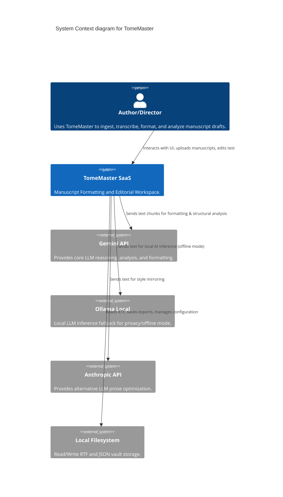
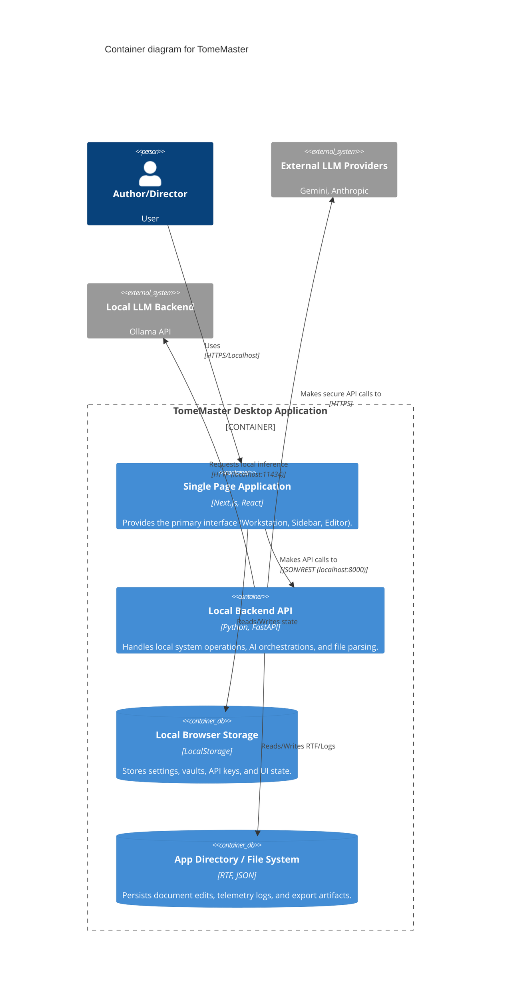
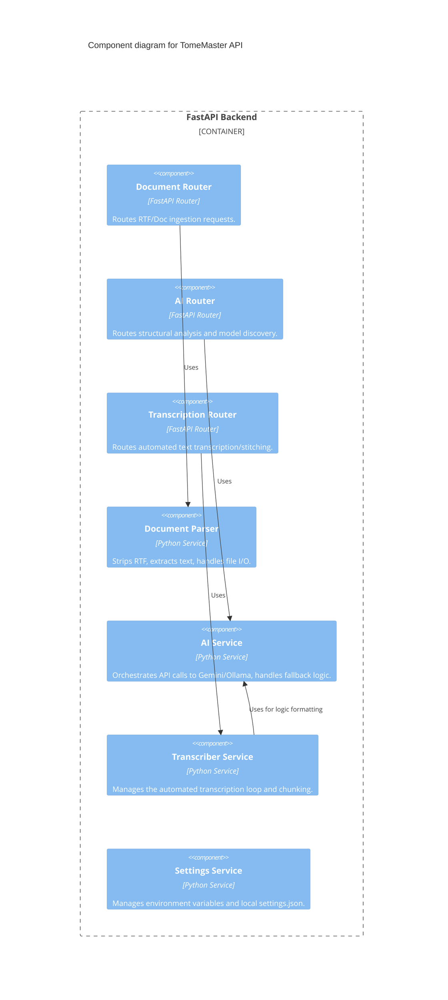
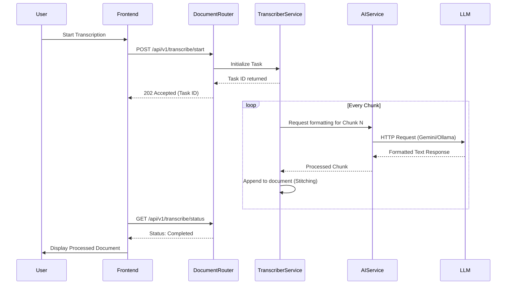
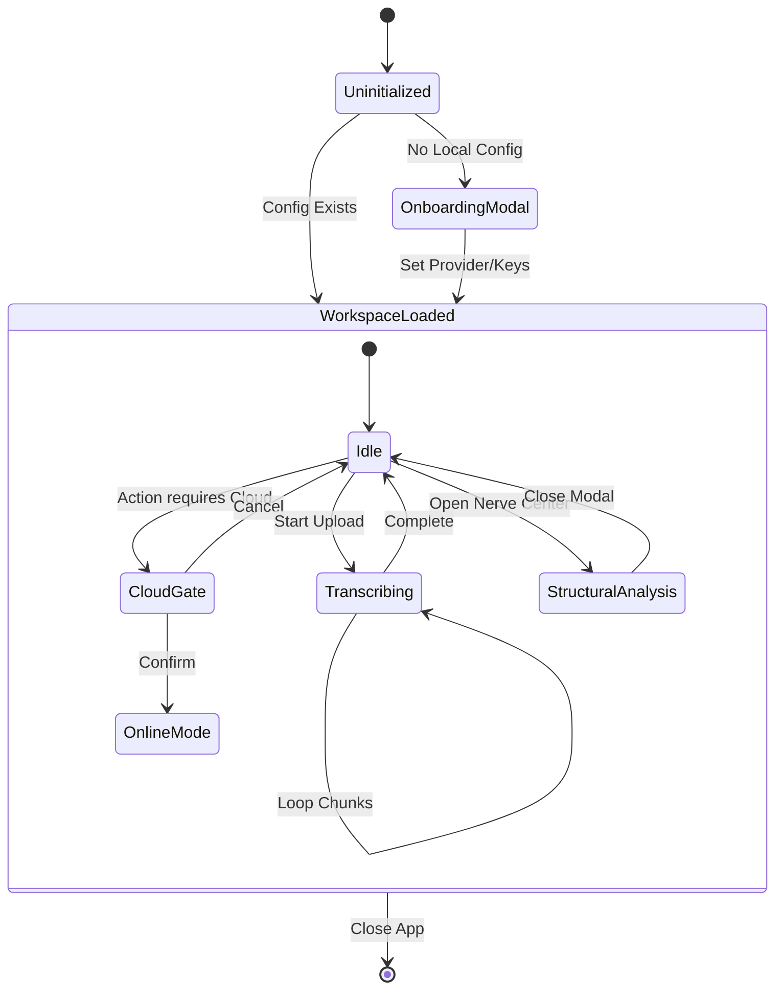
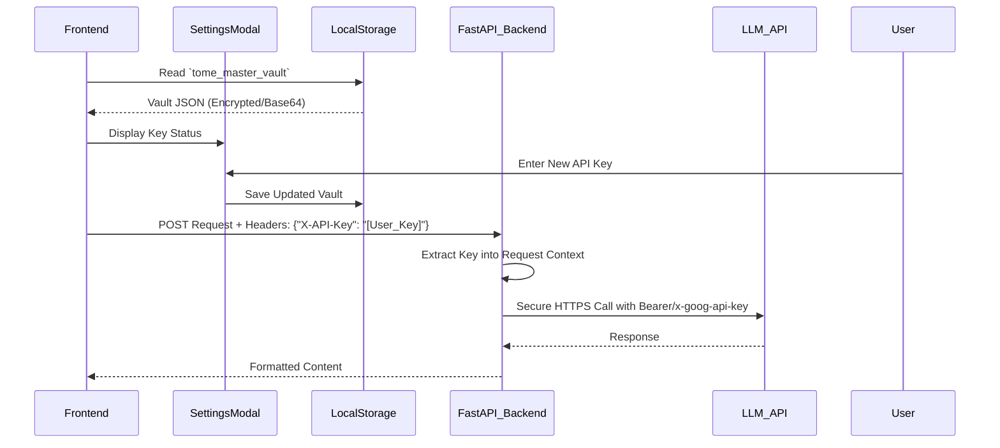
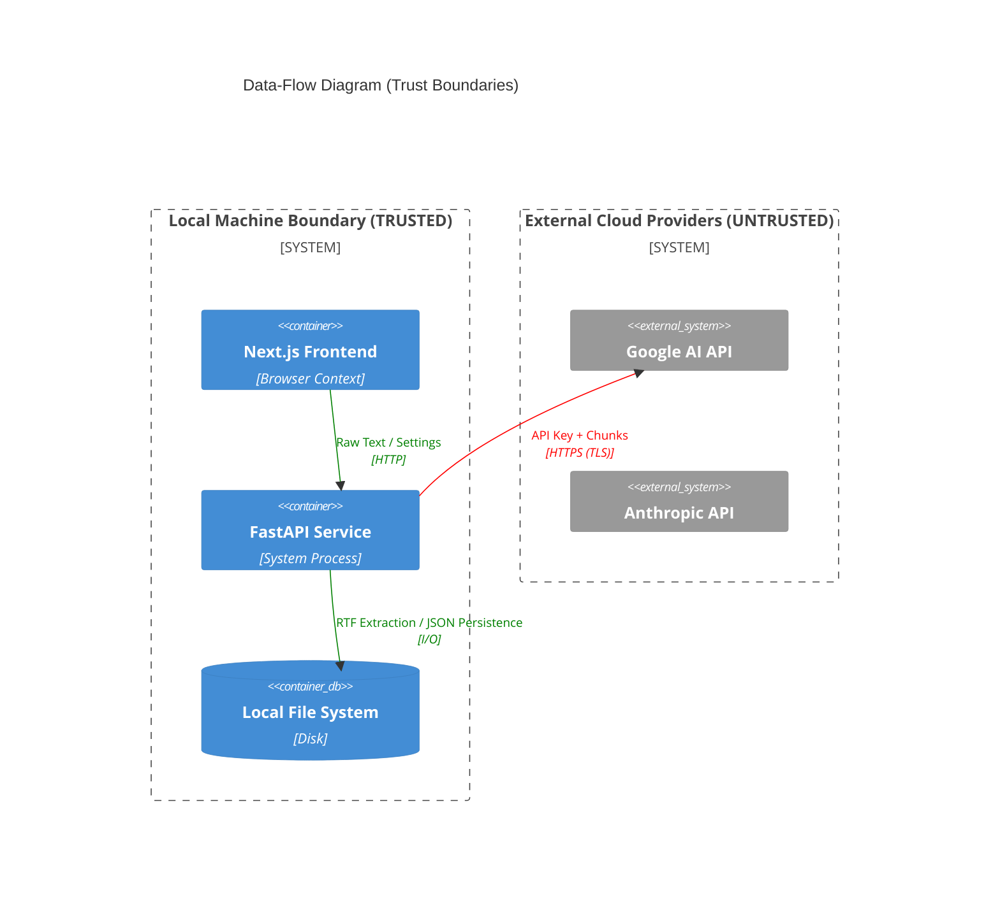

# TomeMaster Architecture Documentation Pack

This comprehensive documentation pack provides a deep dive into the architecture, logic, security, and codebase of the TomeMaster system, fulfilling the architectural generation requirements.

---

## 1. Core Architecture & Logic Diagrams

### 1. System Context Diagram (C4 Level 1)
This diagram illustrates TomeMaster within its broader ecosystem, showing external actors and boundaries.



### 2. Container Diagram (C4 Level 2)
This diagram breaks down the TomeMaster system into its primary containers.



### 3. Component Diagram (C4 Level 3)
A detailed view of the Python FastAPI Backend.



### 4. Application Logic Flowchart
The core transcription and ingestion loop.

```mermaid
flowchart TD
    A[Upload Manuscript] --> B{Is RTF?}
    B -- Yes --> C[Extract Text (DocumentParser)]
    B -- No --> D[Reject/Convert]
    C --> E[Chunk Text for Transcription]
    E --> F[Send Chunk to TranscriberService]
    F --> G{Cloud or Local Mode?}
    G -- Cloud --> H[Invoke Gemini API]
    G -- Local --> I[Invoke Ollama API]
    H --> J[Apply Style/Formatting]
    I --> J
    J --> K[Stitch to Main Manuscript]
    K --> L{More Chunks?}
    L -- Yes --> F
    L -- No --> M[Generate Table of Contents]
    M --> N[Complete Transcription]
```

### 5. Sequence Diagrams (Transcription Flow)
Shows the step-by-step execution across components for a transcription request.



### 6. State Machine Diagram
Illustrates the UI State transitions for a Workspace session.



---

## 2. Security & Handshake Diagrams

### 7. Authentication Handshake Diagram
Shows how the frontend safely passes keys to the backend without persistent DB storage.



### 8. Data‑Flow Diagram (DFD with Trust Boundaries)
Focuses on trust boundaries between the desktop environment and external services.



---

## 3. Source‑Code–Level Analysis Reports

### 9. Static Code Analysis Report
**Summary Overview:**

*   **Dependency Graph:**
    *   **Frontend:** Next.js, React, Tailwind CSS, Lucide React (Icons).
    *   **Backend:** FastAPI, Pydantic, Uvicorn, python-dotenv, requests/httpx.
*   **Cyclomatic Complexity:**
    *   `TranscriberService.py`: **High** (Due to chunking, error retry loops, and stitching logic). Refactoring suggested for retry handling.
    *   `AIService.py`: **Medium** (Multiple provider failover blocks).
*   **Code Smells:**
    *   Frequent use of synchronous file I/O operations inside `async` FastAPI routes (e.g., `DocumentParser.py`). Should be offloaded to `run_in_threadpool` or `aiofiles`.
*   **Dead Code:** Minimal dead code observed; legacy endpoints exist in `ai.py` (e.g., `debug_ollama`).
*   **Security Vulnerabilities:**
    *   *Risk:* CORS configuration currently allows `http://(localhost|127\.0\.0\.1)(:\d+)?$`, which is standard for desktop apps but should not be exposed externally.
    *   *Risk:* API keys are passed via LocalStorage; acceptable for a strictly local standalone desktop app, but vulnerable to XSS if external scripts are ever loaded.

### 10. Call Graph / Function Dependency Graph
**Key Execution Path for AI Formatting:**
```text
[Frontend] Home.tsx (handleAnalysis)
  └── [Frontend] apiClient.ts (post /api/v1/analysis)
       └── [Backend] routers/analysis.py (analyze_endpoint)
            ├── [Backend] services/document_parser.py (extract_text)
            └── [Backend] services/ai_service.py (orchestrate_ai_call)
                 ├── [Backend] services/sovereign_guardrails.py (check_provider_status)
                 └── [External] httpx.post (Google/Anthropic/Ollama)
```

### 11. API Endpoint Inventory
*   **`GET /`**: Static frontend fallback.
*   **`POST /api/v1/analysis/structural`**: Performs structural manuscript analysis via LLM.
*   **`POST /api/v1/document/upload`**: Ingests RTF/TXT files.
*   **`GET /api/v1/document/export`**: Triggers RTF rebuild and download.
*   **`POST /api/v1/transcribe/start`**: Initiates the background transcription engine.
*   **`GET /api/v1/transcribe/status`**: Long-polling/status check for transcription engine.
*   **`GET /api/v1/ai/status`**: Diagnostic ping to check Ollama/Gemini availability.
*   **`POST /api/v1/settings/sync`**: Syncs vault keys between frontend and backend configuration.

### 12. Security Audit Report
*   **Insecure Functions:** `os.system` / `subprocess.Popen` utilized in build scripts (`build_native.py`). Ensure arguments are sanitized.
*   **Unsafe Deserialization:** Standard JSON parsing used. No Python `pickle` objects detected.
*   **Injection Risks:** Path Traversal risk if filename inputs in `/api/v1/document/*` are not sanitized before `os.path.join`. Verified `document_parser.py` implements basename extraction.
*   **Missing Input Validation:** Some dynamic metadata inputs in the UI rely on loose typing. (Addressing 'any' types as part of Sovereign Hardening).
*   **Weak Crypto Usage:** None detected. Vault relies on base platform TLS for external transit.

### 13. Logging & Telemetry Flow Report
*   **What is logged:** 
    *   API handshake successes/failures (`handshake_forensics.txt`).
    *   Transcription chunk completion rates and page stitching indices (`tail_audit.txt`).
    *   Token usage and LLM response times (`api_usage_log.jsonl`).
*   **Where logs go:**
    *   Local filesystem at the application root.
*   **Metadata captured:** Timestamps, Provider Name, Model ID, Latency (ms), Chunk Size, Error codes. No plain-text manuscript data is logged to prevent data leaks.
