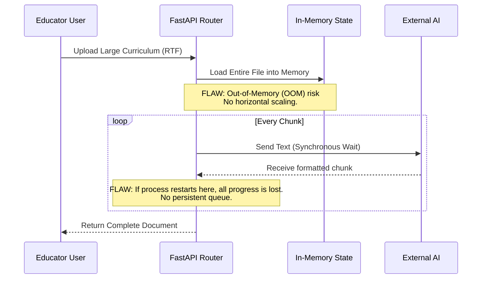
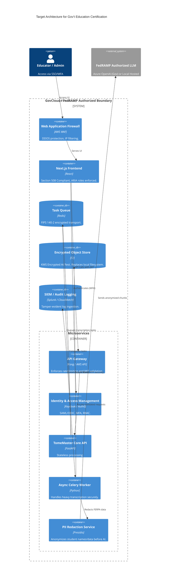

# Government Education Certification: Architectural Gap Analysis

This document provides a critical review of the TomeMaster architecture evaluated against stringent Government Education Certification standards (such as FERPA, FedRAMP Moderate/High, NIST 800-53, and Section 508). 

It highlights architectural flaws, security vulnerabilities, and design inefficiencies that would prevent certification, along with diagrams illustrating these gaps and proposed remediations.

---

## 1. Identified Flaws & Inefficiencies

### A. Data Privacy & Compliance (FERPA / FedRAMP)
1. **External LLM Data Leakage**: Sending unredacted manuscript text to public endpoints (Google Gemini, Anthropic) risks exposing Personally Identifiable Information (PII), such as student names or proprietary educational materials, violating FERPA.
2. **Insecure Credential Storage**: Storing API Vault keys in browser `LocalStorage` is a high-risk vulnerability against Cross-Site Scripting (XSS). FedRAMP requires FIPS 140-2 validated encryption at rest and secure secret management (e.g., AWS KMS, HashiCorp Vault).
3. **Lack of Identity Provider (IdP) Integration**: The system lacks SAML 2.0 / OIDC integration and Multi-Factor Authentication (MFA), which are mandatory for government agency access. There is no Role-Based Access Control (RBAC).

### B. Resilience & Scalability Inefficiencies
1. **Synchronous/Local Bottlenecks**: The system relies heavily on local file I/O (`files.txt`, `handshake_forensics.txt`) and a synchronous, single-process transcription loop. In a multi-tenant government environment, this will crash under concurrent loads.
2. **Missing Distributed Task Queue**: Transcriptions and AI generation run in-memory. If the process dies, the state is lost. Enterprise systems require a distributed queue (e.g., Celery, Redis, RabbitMQ) to guarantee task completion.

### C. Auditability & Telemetry
1. **Tamper-Evident Logging**: Writing logs to local `.txt` files is insufficient. Government systems require centralized, tamper-evident logging integrated with a Security Information and Event Management (SIEM) system.

---

## 2. Gap Analysis Diagrams

### 1. Current Threat Model (STRIDE) - Education Context
This diagram illustrates the current vulnerabilities when deployed in a web-facing educational context.

```mermaid
C4Container
    title Threat Model: Current Vulnerabilities for Education Deployment

    System_Boundary(browser, "Educator Browser") {
        Container(spa, "Next.js UI", "React", "Risk: Section 508 Non-compliance (Accessibility).")
        ContainerDb(local_storage, "LocalStorage", "Risk: XSS Token Extraction. Fails FedRAMP secret management.")
    }

    System_Boundary(backend, "FastAPI Backend") {
        Container(api, "TomeMaster API", "Python", "Risk: Lack of MFA/SSO. No RBAC.")
        ContainerDb(local_fs, "Local Files", "TXT/JSON", "Risk: Tamperable audit logs. Fails NIST 800-53 (AU-9).")
    }
    
    System_Boundary(public_cloud, "Public AI Endpoints") {
        System_Ext(gemini, "Gemini / Anthropic", "Risk: PII/FERPA violation via unredacted text submission.")
    }

    Rel(browser, local_storage, "Stores API Keys (Unencrypted)", "Red")
    Rel(spa, api, "No Auth Token / Identity", "Red")
    Rel(api, local_fs, "Writes local logs", "Red")
    Rel(api, gemini, "Sends raw text chunks", "Red")
```

### 2. Processing Inefficiency: The Transcription Bottleneck
This flow demonstrates why the current application logic is inefficient and uncertifiable for high-availability standards.



---

## 3. Proposed Remediation Architecture (Gov't Certified)

To achieve certification, the architecture must transition from a standalone desktop application to an enterprise-grade, Zero-Trust environment.

### Target Architecture Diagram (FedRAMP/FERPA Compliant)



### Remediation Checklist

1.  **Identity & Access (Zero Trust):**
    *   *Action:* Remove API keys from LocalStorage. Implement server-side session management with HttpOnly cookies.
    *   *Action:* Integrate SAML 2.0 / OIDC for integration with agency directories (Active Directory/Okta). Enforce MFA.
2.  **FERPA Data Protection:**
    *   *Action:* Introduce a PII Redaction Middleware (e.g., Microsoft Presidio) to scrub student names, IDs, and grades before text ever leaves the government boundary.
    *   *Action:* Ensure LLM APIs used are bound by Business Associate Agreements (BAAs) with zero-data-retention clauses (e.g., Azure OpenAI for Government).
3.  **High Availability & Scalability:**
    *   *Action:* Decouple the monolithic transcription loop. Implement an asynchronous worker queue (Celery + Redis) to handle long-running document generation reliably.
4.  **Audit & Compliance:**
    *   *Action:* Rip out local `.txt` file logging. Implement structured JSON logging (e.g., standard output captured by Fluentd) and forward to a centralized SIEM. Log all access attempts, data exports, and configuration changes.
5.  **Accessibility (Section 508):**
    *   *Action:* Audit the Next.js frontend using tools like axe-core. Ensure keyboard navigability, screen reader compatibility, and appropriate color contrast ratios.
